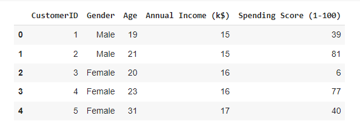
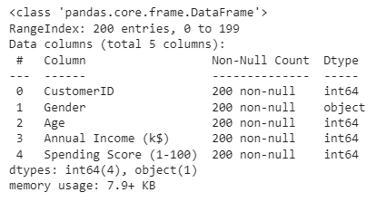
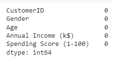
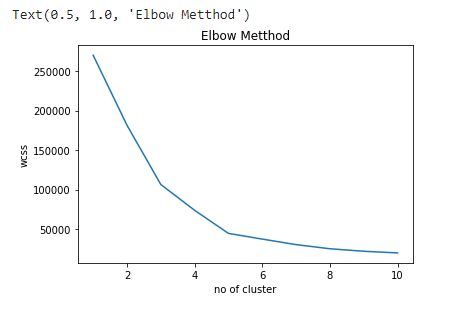
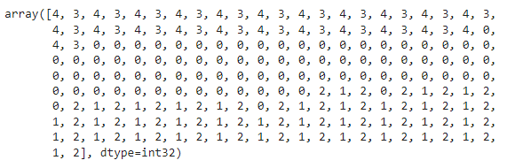
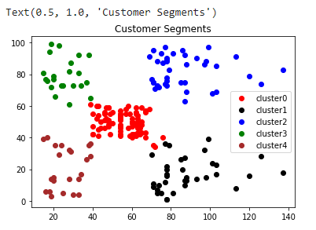

# Implementation-of-K-Means-Clustering-for-Customer-Segmentation

## AIM:
To write a program to implement the K Means Clustering for Customer Segmentation.

## Equipments Required:
1. Hardware – PCs
2. Anaconda – Python 3.7 Installation / Moodle-Code Runner

## Algorithm
1. Import the required packages.
2. Import the dataset to work on.
3. From sklearn module import kmeans.
4. Define number of clusters to be made.
5. Assign the cluster values.
6. Plot the cluster using matplotlib.pyplot
7. End the program.


## Program:
```
/*
Program to implement the K Means Clustering for Customer Segmentation.
Developed by: 
RegisterNumber:  
*/
# exp 7 clustering
import pandas as pd
import matplotlib.pyplot as plt
data=pd.read_csv("/content/Mall_Customers.csv")
data.head()
data.info()
data.isnull().sum()
from sklearn.cluster import KMeans
wcss=[]
for i in range(1,11):
  kmeans=KMeans(n_clusters=i,init="k-means++")
  kmeans.fit(data.iloc[:,3:])
  wcss.append(kmeans.inertia_)
plt.plot(range(1,11),wcss)
plt.xlabel("no of cluster")
plt.ylabel("wcss")
plt.title("Elbow Metthod")
km=KMeans(n_clusters=5)
km.fit(data.iloc[:,3:])
y_pred=km.predict(data.iloc[:,3:])
y_pred
data["cluster"]=y_pred
df0=data[data["cluster"]==0]
df1=data[data["cluster"]==1]
df2=data[data["cluster"]==2]
df3=data[data["cluster"]==3]
df4=data[data["cluster"]==4]
plt.scatter(df0["Annual Income (k$)"],df0["Spending Score (1-100)"],c="red",label="cluster0")
plt.scatter(df1["Annual Income (k$)"],df1["Spending Score (1-100)"],c="black",label="cluster1")
plt.scatter(df2["Annual Income (k$)"],df2["Spending Score (1-100)"],c="blue",label="cluster2")
plt.scatter(df3["Annual Income (k$)"],df3["Spending Score (1-100)"],c="green",label="cluster3")
plt.scatter(df4["Annual Income (k$)"],df4["Spending Score (1-100)"],c="brown",label="cluster4")
plt.legend()
plt.title("Customer Segments")
```

## Output:









## Result:
Thus the program to implement the K Means Clustering for Customer Segmentation is written and verified using python programming.
